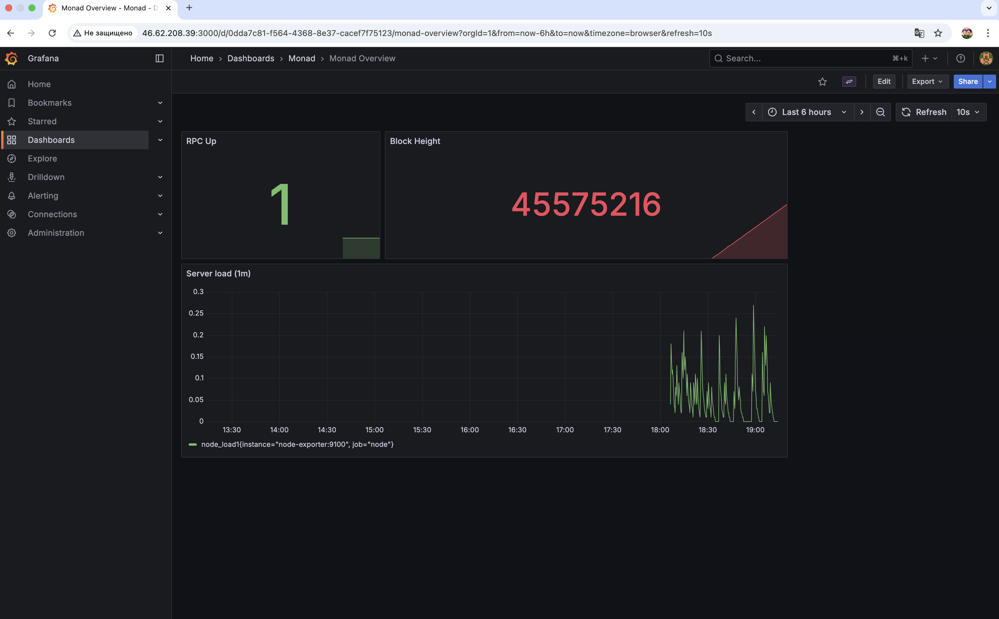

# 📊 Monad Path to Rank S — Stage 2.1 Report  
**Focus:** Monitoring & Automation with Prometheus + Grafana  
**Author:** [Asplana92](https://github.com/Asplana92)  
**Date:** October 26, 2025  

---

## 🎯 Goal  
To extend the Monad Testnet RPC infrastructure (Stage 1) with a full monitoring stack:  
- Prometheus (metrics collector)  
- Grafana (dashboard visualization)  
- Node Exporter (system metrics)  
- Custom Bash script for Monad JSON-RPC health checks  

---

## 🧩 Setup Overview  

**Server:** Hetzner Ubuntu 24.04 (8 GB RAM)  
**Network:** `monad-monitor` Docker bridge  
**Services:** Prometheus (9090), Node Exporter (9100), Grafana (3000)  

Prometheus scrapes:
- Node Exporter → CPU, RAM, disk load  
- Custom Monad metrics → `monad_rpc_up`, `monad_block_height`

Grafana visualizes uptime & block height from Prometheus data source.

---

## ⚙️ Systemd Integration  

All services managed via systemd with `Restart=always` and health logic from Stage 1.  
Custom timer `monad-metrics.timer` updates metrics every 5 minutes via Bash script:

```bash
/usr/local/bin/monad-metrics.sh

Script queries:

eth_blockNumber via local RPC → height + uptime status

Exports Prometheus-compatible .prom file → /opt/monad-monitor/textfile/monad.prom

📈 Grafana Dashboard

Dashboard auto-provisioned via provider.yml:

RPC Uptime (✅ = 1 healthy)

Block Height gauge

Server Load graph (1 m avg)

Datasource: Prometheus → UID PROM_DS
Folder: Monad / Monad Overview

🖼 Screenshot 



🧠 Key Takeaways

✅ Complete monitoring stack for Monad Testnet RPC
✅ Automatic metrics collection & visualization
✅ Systemd auto-restart and persistent data volumes
✅ Next step: enable HTTPS access and Alerting (Stage 3)

🔗 Links

Repository: Web3-Journey

Stage 1 Report: Monad RPC Infra Setup

Twitter: @02Tolik02

Discord: Tolik #share-projects

🏁 Status: Stage 2 Completed

Prometheus and Grafana monitoring fully deployed and live.
Next Stage: HTTPS & Public Status Dashboard (Stage 3).
